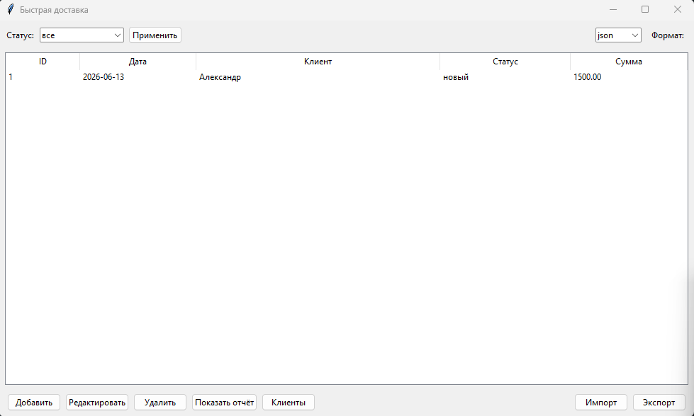
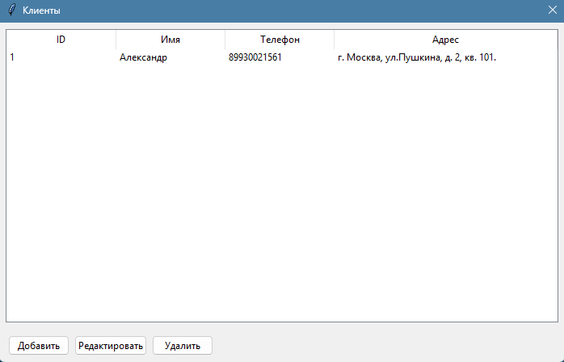
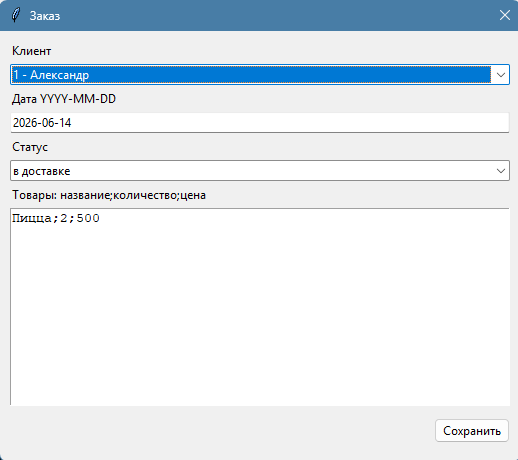
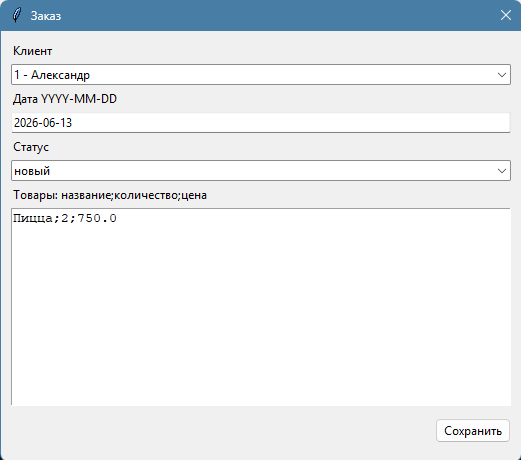
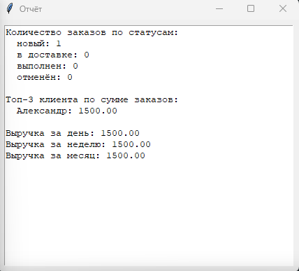

# Быстрая доставка

Учебный проект на Python 3.8+ для внутреннего учёта клиентов, заказов, товаров, отчётов, импорта и экспорта данных.

## Технологический стек

- Python 3.8+
- SQLite как основная база данных
- TinyDB как дополнительный вариант хранения
- Tkinter для GUI
- argparse для CLI
- logging для логирования
- pytest для тестов
- json и xml.etree.ElementTree для импорта и экспорта

## Структура проекта

```text
delivery_system/
├── __init__.py
├── main_cli.py
├── main_gui.py
├── database.py
├── models.py
├── data_export.py
├── logger_config.py
├── tests/
│   ├── test_database.py
│   ├── test_models.py
│   └── test_export.py
├── pictures/
│   ├── main.png
│   ├── clients.png
│   ├── new_order.png
│   ├── edit.png
│   └── report.png
├── logs/
│   └── app.log
├── data/
│   ├── delivery.db
│   └── tinydb.json
├── requirements.txt
└── README.md
```

Файл `data/delivery.db` создаётся автоматически при первом запуске приложения.

## Установка

```bash
cd delivery_system
python -m venv .venv
.venv\Scripts\activate
pip install -r requirements.txt
```

На Linux и macOS активация окружения:

```bash
source .venv/bin/activate
```

## Запуск CLI

Команды выполняются из папки `delivery_system`.

```bash
python main_cli.py customer add --name "Иван" --phone "+79990000000" --address "Москва"
python main_cli.py customer list
python main_cli.py order add --customer-id 1 --date 2026-06-13 --status "новый" --item "Пицца;2;750"
python main_cli.py order list
python main_cli.py report --period month
```

Экспорт заказов:

```bash
python main_cli.py export --file orders_backup.json
python main_cli.py export --file orders_backup.xml
```

Импорт заказов:

```bash
python main_cli.py import --file orders_backup.json
python main_cli.py import --file orders_backup.xml
```

Дополнительные команды:

```bash
python main_cli.py customer update --id 1 --name "Иван Петров"
python main_cli.py customer delete --id 1
python main_cli.py order update --id 1 --status "в доставке"
python main_cli.py order delete --id 1
```

Удалить клиента нельзя, если у него есть заказы.

## Запуск GUI

```bash
cd delivery_system
python main_gui.py
```

В GUI доступны список заказов, фильтр по статусу, добавление, редактирование, удаление заказов, окно клиентов, отчёт, импорт и экспорт JSON/XML.

## Скриншоты

Главное окно приложения:



Окно клиентов:



Добавление заказа:



Редактирование заказа:



Окно отчёта:



## Запуск тестов

Из корня репозитория:

```bash
pytest delivery_system/tests
```

Или из папки проекта:

```bash
pytest tests
```

## Импорт и экспорт

Экспортируются все заказы вместе с данными клиента и списком товаров. При импорте проверяются обязательные поля: дата заказа, статус, список товаров, название товара, количество и цена. Ошибки импорта выводятся понятным сообщением и записываются в `logs/app.log`.

Поддерживаемые форматы:

- JSON
- XML

## Возможности

- CRUD для клиентов
- CRUD для заказов
- запрет удаления клиента с заказами
- фильтрация заказов по статусу и дате
- отчёт по количеству заказов в статусах
- топ-3 клиента по сумме заказов
- выручка за день, неделю и месяц
- импорт и экспорт заказов в JSON и XML
- CLI и GUI режимы работы
- логирование ошибок и действий
- SQLite как основная БД
- TinyDB как бонусный вариант
